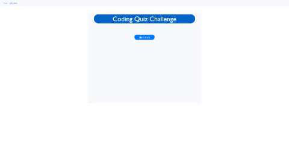

    # Product Name
> Coding Quiz Webpage

This is multiple-choice questions, interactive coding quiz website. This quiz is timed and timer will start and countdown once "Start Here" button clicked on homepage. 5 questions to answer. Once quiz is done user will be able to see their scores. User can go back to home page by pressing "Go back" located on nav bar.

## Screenshots

## User Story

As a coding bootcamp student

I want to take a timed quiz on JavaScript fundamentals that stores high scores

so that I can gauge my progress compared to my peers

## Meta

[Coding Quiz Repo](https://github.com/boohordekiller/week4-hw-quiz)

[Coding Quiz](https://boohordekiller.github.io/week4-hw-quiz/start.html)

